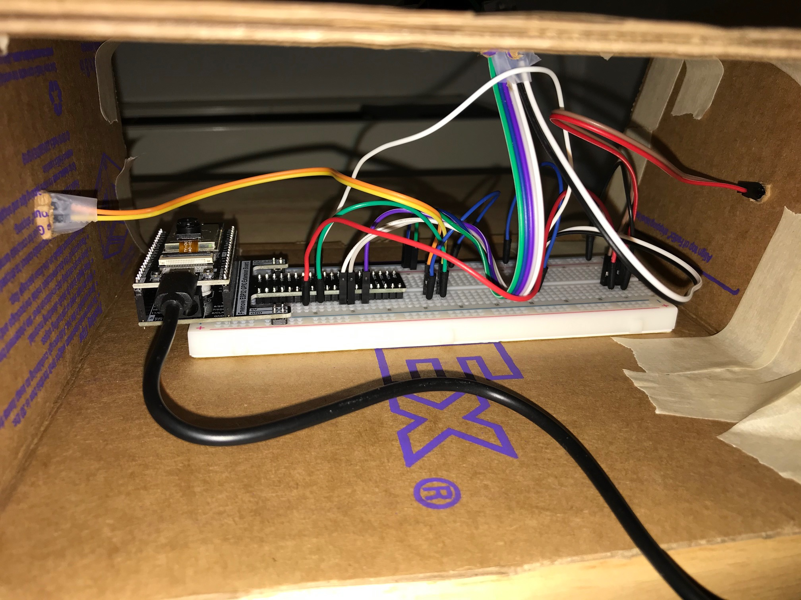
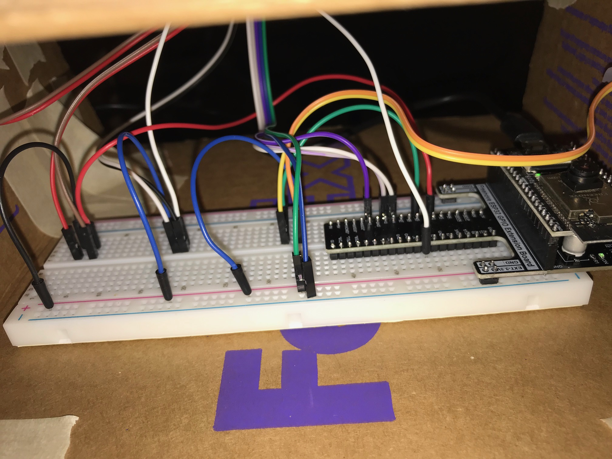

# The Prison's Dilemma

I decided to implement a form of the classic Prison's Dilemma with a few twists. This game is two players and each player has a button. If no player presses their respective button, then both players win. If one player presses their respective button, then that player wins. If both players press their buttons, then they both lose. The joystick in the middle can be used to adjust the timer, either increase or decrease time. There is a switch in the middle that can be used to restart the game when it is over. [Click here for a demo of the device in action.](https://www.youtube.com/watch?v=WCk72UkHF9g&ab_channel=MichaelLeoWinitch) The rest of this README will focus on technical details. 

## The Hardware

The hardware of this project consists of an ESP32 connected to a breadboard. Connected to the ESP32 and the breadboard are two buttons, a jotstick, and a switch. The ESP32 is then connected to a Raspberry Pi, which is connected to a moinitor that allows for the display. 

The joystick has five wires that must be plugged in. These are 5V, GND, VRX, VRY, and SW. GND and 5V get connected to ground and the voltage for the ESP32 respectively. VRX goes to GPIO 13, and VRY goes to GPIO 12, and SW goes to GPIO 14. All of these GPIO refer to the ESP32's pins. 

Each button is connected with two wires. One wire goes to a ESP32 GPIO pin (it does not matter which one, as long as it is a number, and you may have to experiment which ones work for you), and then the other wire to the GND of the ESP32. I also then used wires to connect the tips of the button to the breadboard, so that the buttons were not directly plugged into the breadboard. This allowed me to create a setup which meant the buttons could be placed in the setup enclosure.

The switch is also connected by two wires. One goes to a GPIO pin, and another goes to ground. Once again, like the buttons, I connect the switch to wires which connect to the breadboard. This helps to extend the reach of where I can place my switch which is useful for the enclosure. 

Then, I connect the ESP32 to the Raspberry Pi with a USB. Do not use a regular charging USB cable to connect them, that will not work. Below are some images of the wiring.

<br>


<br>

## Arduino Software

First we must get input from our devices (buttons, joystick, and switch) and send that as a serializable steam to be used. The file `serial/serial.ino` handles getting inputs and creating the stream. As an important note, whatever GPIO pins you used for each input device, make sure you set them correctly in the `pinMode` and `digitalRead` functions. Also take note of the value used in `serial.begin()` as it may need to be changed. 

I recommend the following be done on a computer, not the Raspberri Pi. Connect the ESP32 with the USB into your computer (unplug it from the Pi if you did so). Then, open Arduino (or download if you have not done so) and upload the `serial.ino` code to the ESP32. To check if everything is working, under tools open the serial monitor and adjust the various buttons and the joystick to see if values are changing. 

## Processing Software

Now with the code uploaded to the ESP32, we can move onto the processing. Now make sure you plug your ESP32 into your Raspberry Pi. Next, you need to get Processing on your Raspberry Pi. To get Processing for a Raspberry Pi, [click here](https://pi.processing.org/download/). Once that is done, make sure to clone this repo onto your Pi. Then in Processing, open up `visuals/visuals.pde`. Line 25 of the script is the following:
```
String portName = Serial.list()[0];
```
You may have to change the index to get the correct port. Other than that, you can hit run and should be all good to go. 
